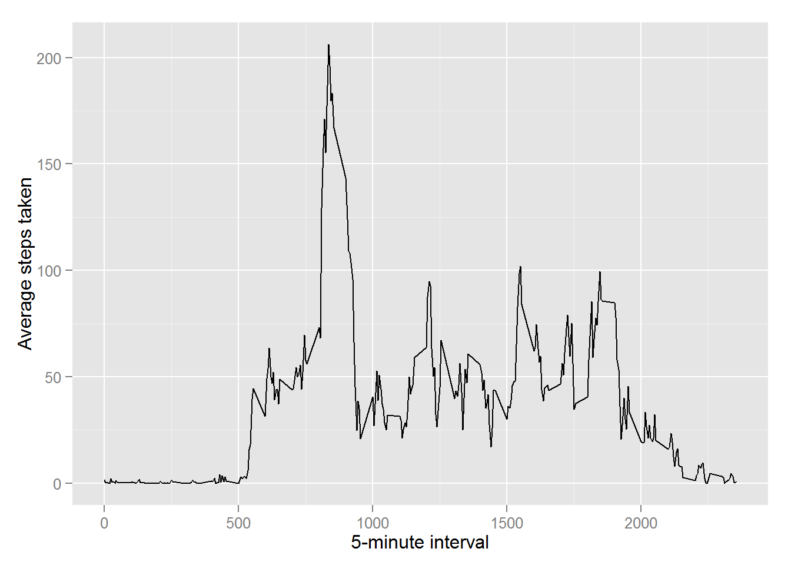
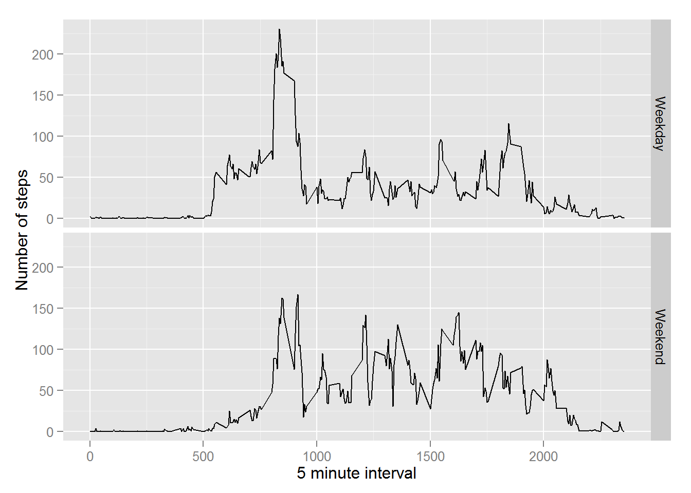

Reproducible Research: Peer Assessment 1
========================================

Loading and preprocessing the data
----------------------------------

    #Unzip the csv
    unzip("repdata-data-activity.zip")

    #read csv
    activity <- read.csv("activity.csv")

What is mean total number of steps taken per day?
-------------------------------------------------

#### 1. Calculate the total number of steps taken per day

    totalStepPerDay <- tapply(activity$steps, activity$date, sum, na.rm = TRUE)

#### 2. Make a histogram of the total number of steps taken each day

    library(ggplot2)
    qplot(totalStepPerDay, xlab = "Total steps per day")

    ## stat_bin: binwidth defaulted to range/30. Use 'binwidth = x' to adjust this.

#### 3. Calculate and report the mean and median of the total number of steps taken per day

    mean(totalStepPerDay)

    ## [1] 9354.23

    median(totalStepPerDay)

    ## [1] 10395

What is the average daily activity pattern?
-------------------------------------------

#### 1. Make a time series plot (i.e. type = "l") of the 5-minute interval (x-axis) and the average number of steps taken, averaged across all days (y-axis)

    library(ggplot2)
    averageStepsPerInterval <- aggregate(x = list(steps = activity$steps), by = list(interval = activity$interval), FUN = mean, na.rm = TRUE)
    ggplot(data = averageStepsPerInterval, aes(x = averageStepsPerInterval$interval, y = averageStepsPerInterval$steps)) + geom_line() + xlab("5-minute interval") + ylab("Average steps taken")

#### 2. Which 5-minute interval, on average across all the days in the dataset, contains the maximum number of steps?

    averageStepsPerInterval[which.max(averageStepsPerInterval$steps),]

    ##     interval    steps
    ## 104      835 206.1698

Imputing missing values
-----------------------

#### 1. Calculate and report the total number of missing values in the dataset (i.e. the total number of rows with NAs)

    missingValues <- is.na(activity$steps)
    table(missingValues)

    ## missingValues
    ## FALSE  TRUE 
    ## 15264  2304

#### 2. Create a new dataset that is equal to the original dataset but with the missing data filled in.

    filledData <- activity

    for(index in 1:length(filledData[[1]])) {
        if(is.na(filledData[index,]$steps)) {
            filledData[index,]$steps <- averageStepsPerInterval[averageStepsPerInterval$interval == filledData[index,]$interval, "steps"]
        }
    }

#### 3. Make a histogram of the total number of steps taken each day...

    totalStepPerDayAfterFillingData <- tapply(filledData$steps, filledData$date, sum, na.rm = TRUE)
    qplot(totalStepPerDayAfterFillingData, xlab = "Total steps per day")

    ## stat_bin: binwidth defaulted to range/30. Use 'binwidth = x' to adjust this.

#### ...Calculate and report the mean and median total number of steps taken per day.

    mean(totalStepPerDayAfterFillingData)

    ## [1] 10766.19

    median(totalStepPerDayAfterFillingData)

    ## [1] 10766.19

Are there differences in activity patterns between weekdays and weekends?
-------------------------------------------------------------------------

#### 1. Create a new factor variable in the dataset with two levels - "weekday" and "weekend" indicating whether a given date is a weekday or weekend day.

    weekday <- function(date) {
        day <- weekdays(date)
        if(day %in% c("Monday", "Tuesday", "Wednesday", "Thursday", "Friday"))
        {
            return("Weekday")
        } else if (day %in% c("Saturday", "Sunday")) {
            return("Weekend")
        }
        return("Invalid date")
    }
    filledData$day <- sapply(as.Date(filledData$date), FUN = weekday)

#### 2. Make a panel plot containing a time series plot (i.e. type = "l") of the 5-minute interval (x-axis) and the average number of steps taken, averaged across all weekday days or weekend days (y-axis).

    averageStepsPerWeekday <- aggregate(steps ~ interval + day, data = filledData, mean)
    ggplot(averageStepsPerWeekday, aes(interval, steps)) + geom_line() + facet_grid(day ~ .) + xlab("5 minute interval") + ylab("Number of steps")

